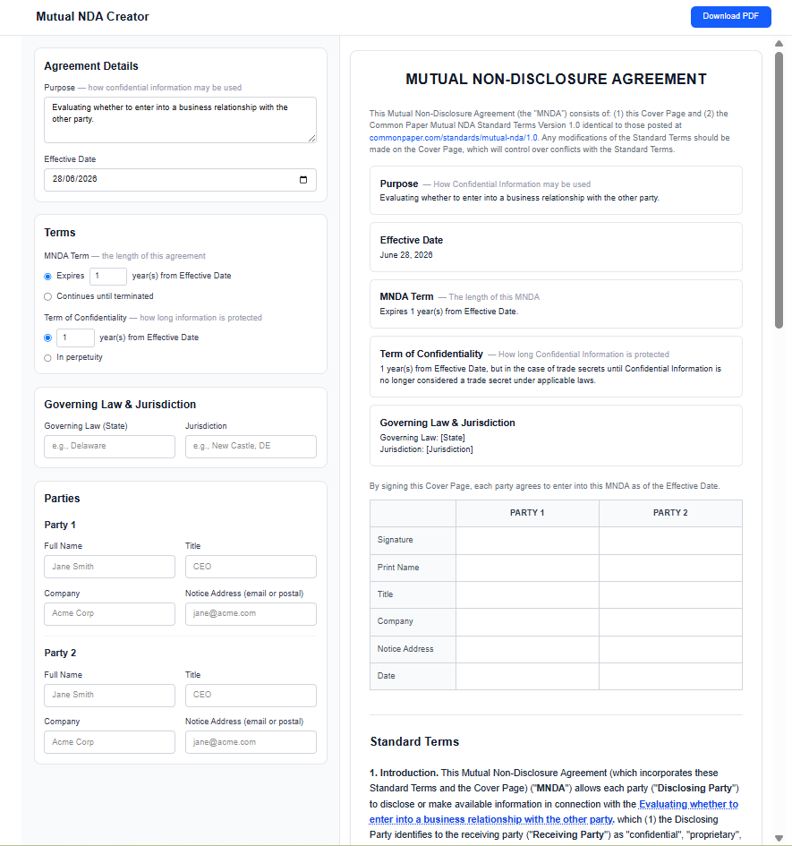
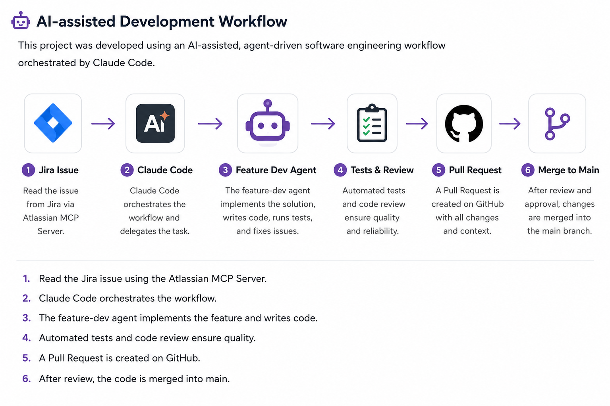

# AI Prelegal – Mutual NDA Creator

A modern Next.js application for creating Mutual Non-Disclosure Agreements (Mutual NDAs) with a live split-view editor and PDF export.



---

## Features

- Live split-view editor
- Real-time document preview
- PDF export
- Responsive layout
- Automated testing (Jest + Playwright)

---

## Tech Stack

- Next.js 16
- React 19
- TypeScript
- Tailwind CSS v4
- html2canvas
- jsPDF
- Jest
- Playwright

---


## Getting Started

```bash
npm install
npm run dev
```

Open:

```
http://localhost:3000
```

---

## Available Scripts

```bash
npm run dev
npm run build
npm start
npm test
npm run test:e2e
```




---

